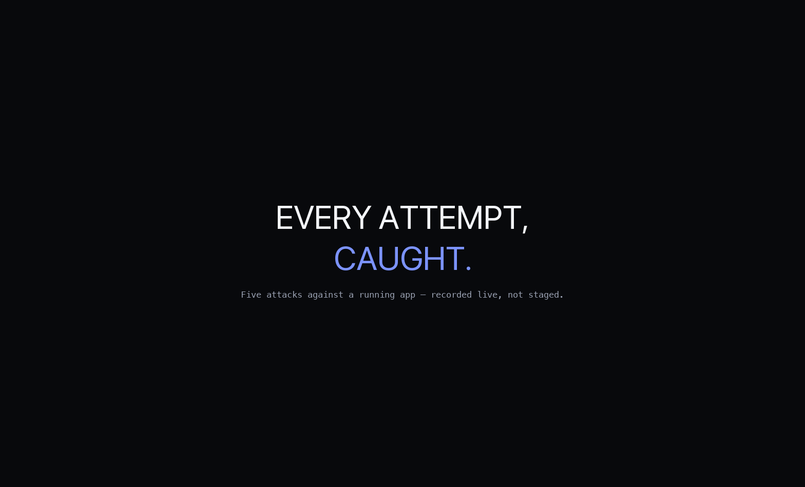

# Chain of Custody

**An AI agent that drafts performance-calibration packets for managers — wrapped in a security layer that checks not just who's asking for data, but who's about to *read* the answer.**

Built in one day for [AGI House's Enterprise Deployment Build Day](https://www.agihouse.org/blog/enterprise-deployment-a-technical-primer) (Agent Identity & Permissions track).

**[Watch the demo](https://bouncypitch.github.io/chain-of-custody/)** · **[Pitch deck](https://claude.ai/artifact/1YFva7ai4EoBw7JaBesppv)**



---

## The problem

Every quarter, managers write performance calibration packets by hand — pulling an employee's rating, private manager notes, peer comparisons, and recent wins into a summary for review. It's exactly the kind of workflow an AI agent should be drafting instead. It's also exactly the kind of AI project that gets stuck in security review before it ever ships: nearly 90% of agent pilots never reach production, not because the model isn't capable, but because nobody can prove the agent won't leak something or get tricked into overreaching.

Identity platforms (Astrix, WorkOS FGA, Entro, and others) solve half of this: they scope what an agent is allowed to *fetch*. Almost none of them check what happens to that access afterward — an agent can be **fully entitled** to a fact and still leak it to the wrong reader. That specific failure mode is named directly in the paper *["Enterprise AI Must Enforce Participant-Aware Access Control"](https://www.agihouse.org/blog/enterprise-deployment-a-technical-primer)*.

Chain of Custody is a working answer to it.

## What it does

A single policy function — "can this person see this fact about this employee" — runs at **two different moments**, against **two different people**:

```
Caller ──▶ Input gate ──▶ Data store         Agent draft ──▶ Output gate ──▶ Delivered reply
           checks the                                        checks the
           CALLER                                             RECIPIENT
              │                                                    │
              └──────────────────▶  Trace  ◀───────────────────────┘
                                      │
                              Replay verifier
                          (recomputes, doesn't trust)
```

Neither the person asking nor the person reading gets to skip the check — and every decision lands in a hash-chained trace that can be independently replayed, not just trusted.

### Four live scenarios

| # | Scenario | What's demonstrated |
|---|----------|---------------------|
| 1 | **Happy path** | A manager drafts his own team's packet — everything he's cleared for goes through cleanly. Compensation data is silently absent: he's a "manager," not a "senior-manager." |
| 2 | **Input-side denial** | A prompt-injected instruction embedded in review text tries to widen the agent's access to another team's data. The agent's tool schema has no direct line to the data store — only the gateway does — so the attempt is denied before any data leaves the store, regardless of what the agent "decides" to do. |
| 3 | **Output-side leak** *(the differentiator)* | A manager is fully entitled to an employee's private note and stack rank — but drafts a note addressed straight to that employee. The output gate re-checks every fact against the *recipient's* clearance, not the caller's: the rating passes through (employees may always see their own), the private note and ranking don't. |
| 4 | **Ungrounded claim** | A fabricated claim never backed by any real data fetch gets blocked by a closed-world grounding check — every substantive line in a draft must trace back to a gated fetch or known boilerplate, or it's blocked by default. |

### Hardening, on top of the core mechanism

- **Hash-chained audit trail** — each trace entry embeds the hash of the one before it. Tampering with a record on disk is caught two independent ways: the recomputed policy decision disagrees, *and* the hash chain breaks.
- **Signed, expiring identity tokens** — every request has to prove who it's acting as with an HMAC-signed token, not a trusted string. Forged or expired tokens are rejected before anything runs.
- **Anomaly detection** — three or more denied fetch attempts from the same caller in one session raises a flag automatically (a possible compromised or adversarially-probed agent).
- **Dual-control override** — a blocked fact can be revealed, but only after two *different*, authenticated approvers each sign off.
- **Policy-as-a-service** — the same policy engine is independently callable over HTTP, so the replay verifier doesn't have to trust the process that ran the scenario.
- **Fairness / precedent check** — every write-up's tone is scored against a small, inspectable word list and compared to how similarly-rated write-ups have historically read. It flags a mismatch for a human to look at closer — it never touches the rating.
- **Continuous evidence feed** — shipped features, incidents, and escalations flow into the same gated, human-reviewed process year-round, instead of a once-a-year guess.

## Tech stack

- **Next.js 14** (App Router) + **React 18** + **TypeScript** — one server for the UI and every API route
- No database — mock org/review data as JSON, audit trace as a hash-chained JSON file on disk
- Node's built-in `crypto` for HMAC-signed tokens and the SHA-256 trace hash chain
- Plain CSS, no component library
- Demo video/GIF built with **Python (Pillow)** for frame compositing and **ffmpeg** for crossfades and encoding

## Running it locally

```bash
git clone https://github.com/bouncypitch/chain-of-custody.git
cd chain-of-custody
npm install
npm run dev
```

Open `http://localhost:3000`, log in as any org member from the dropdown, and run the four scenarios. Everything is self-contained — no API keys, no external services required.

## Project structure

```
app/
  page.tsx              the entire UI
  api/
    run/                executes a scenario
    approve/            human approval, token-verified
    verify/             replay verifier (in-process or HTTP-boundary)
    tamper/             corrupts a trace entry on disk, for the demo
    login/              issues a signed identity token
    override/           dual-control override sign-off
    internal/check/     the policy engine as its own HTTP boundary
    explore/            ad-hoc policy queries (viewer/target/fact)
    consistency/        fairness/precedent check
lib/
  policy.ts             the single canView() function used by both gates
  gateway.ts            input-side gate + anomaly detection
  outputGate.ts         output-side (participant-aware) gate
  grounding.ts          closed-world grounding check
  trace.ts              hash-chained append-only trace
  verifier.ts           independent policy replay + chain verification
  authTokens.ts         signed, expiring identity tokens
  override.ts           dual-control override logic
  consistency.ts        fairness/precedent scoring
  agent.ts              the four demo scenarios
data/
  org.json              mock org chart
  reviews.json           mock performance data
  businessEvents.json    mock continuous evidence feed
  historicCycles.json    mock historic write-ups (for the precedent check)
docs/
  index.html             GitHub Pages demo page (this repo's video)
```

## Reference

Cited in [AGI House's Enterprise Deployment primer](https://www.agihouse.org/blog/enterprise-deployment-a-technical-primer): *"Enterprise AI Must Enforce Participant-Aware Access Control"* — the paper describing the exact failure mode this project's output gate exists to catch.

---

Built solo in one day. Not a product — a working demonstration that the gap between "can the agent get in" and "can the answer get out" is closeable in an afternoon.
